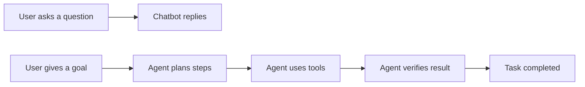
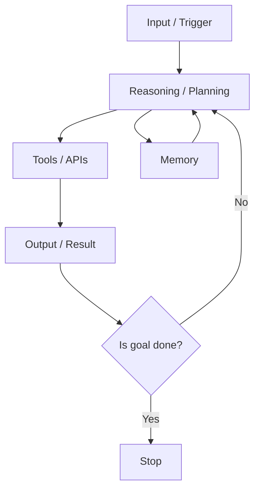
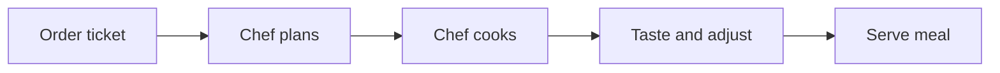
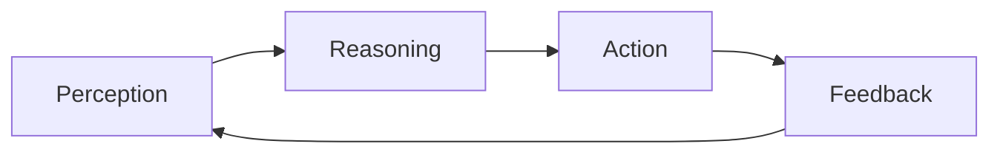

# Chapter 1: The Agentic Shift

The last decade of AI was about **prediction**. The next decade is about **action**.

Chatbots made AI feel accessible. Agents make AI useful. A chatbot answers questions; an agent completes tasks. This chapter introduces the shift from “talking” systems to “doing” systems and gives you a clear mental model for how modern agents work.

## 1.1 Introduction to AI Agents
An AI agent is a software system that can:
- **Perceive** information from the user or environment
- **Reason** about that information
- **Act** using tools, APIs, or code
- **Reflect** on results and iterate

This makes agents fundamentally different from static scripts or Q&A bots. Agents are designed to operate in **loops**, not just single turns.

## 1.2 Agent vs. Chatbot (The Practical Difference)
A chatbot is reactive. It waits for your prompt and responds. An agent is proactive. It can decide what to do next and execute steps to complete a goal.

**Example:**
- Chatbot: “Here’s how to book a meeting.”
- Agent: “I checked your calendar, found an open slot, created the invite, and emailed the attendee.”

The difference is not just better language. It is **tool use + decision making + feedback loops**.

## 1.3 Foundations You Must Know
To build agents that work in the real world, you need to understand three core foundations:

1. **Control Flow**
- Agents operate in steps. Each step produces a decision: continue, call a tool, ask a question, or stop.
- You control the loop with code, not prompts alone.

2. **State**
- An agent must carry memory across steps: what it knows, what it did, and what it plans next.
- State can be short-term (context window) or long-term (database, vector store, logs).

3. **Tools**
- Tools are the bridge to the real world: APIs, databases, browsers, file systems.
- Without tools, agents are confined to text. With tools, they become operators.

## 1.4 Architecture of an AI Agent
At a high level, most agent systems follow a simple architecture:

- **Input Layer**: User request or system trigger
- **Reasoning Layer**: LLM interprets goal, plans steps
- **Tooling Layer**: APIs and functions that do the work
- **Memory Layer**: Context, logs, knowledge store
- **Orchestration Layer**: The loop that coordinates it all

Think of it as a small company:
- The **LLM** is the strategist
- The **tools** are the workers
- The **memory** is the institutional knowledge
- The **orchestration code** is the manager

## 1.5 Analogy: The Chef in a Kitchen
A good analogy for agents is a chef running a busy kitchen:
- **Perception**: The chef reads the order
- **Reasoning**: The chef decides what to cook and in what order
- **Action**: The chef uses tools (knife, stove, oven)
- **Feedback**: The chef tastes and adjusts

No single step is enough. The power comes from looping through the process quickly and accurately.

## 1.6 The Agent Loop
Every agent you build in this repo will follow the same loop:

**Perception -> Reasoning (Brain) -> Action (Tools) -> Feedback**

If you understand this loop, you can design agents for almost any task.

## 1.7 The Economy of Agents
Why are companies paying top dollar for agent builders?

Because businesses want outcomes, not demos. A real agent:
- Reduces labor costs by automating workflows
- Speeds up decision-making
- Improves consistency and quality
- Scales expertise across the organization

In short, an agent is not a toy — it is a **profit center**. This is why developers who can build reliable, tool-using agents are in demand.

## Key Takeaways
- Agents complete tasks; chatbots answer questions
- The agent loop is the core mental model
- Real agents require control flow, state, and tool use
- Agent builders are valuable because they deliver outcomes

## What Comes Next
In Chapter 2, we cover the tools and tech stack you will use to build agents: Python libraries, LLM providers, and orchestration frameworks.
