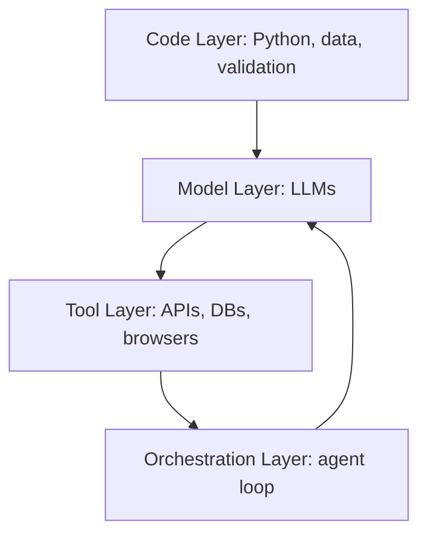
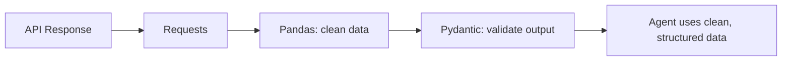
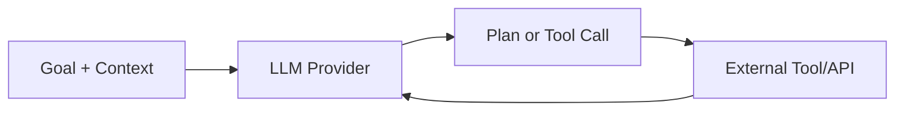
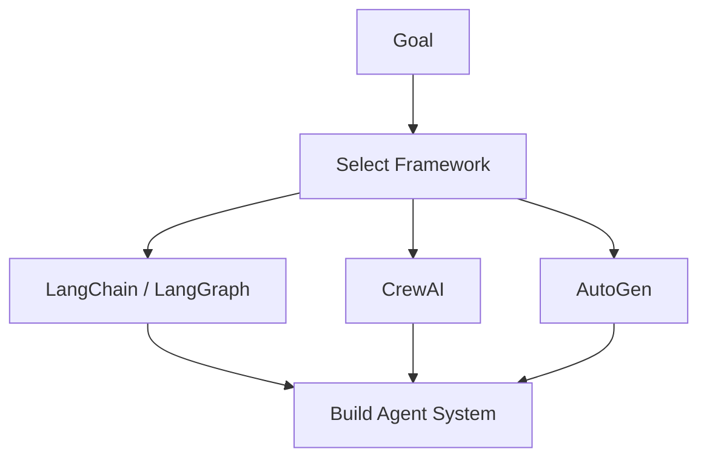
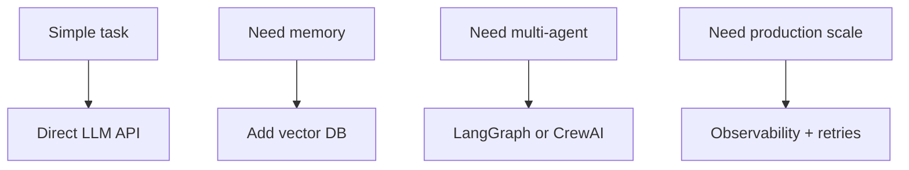

# Chapter 2: Tools & Tech Stack (Your Toolkit)

Agents are not built from prompts alone. They are built from **code + models + tools + orchestration**. This chapter gives you a clear map of the agent stack and the exact technologies you need to get started.

## 2.1 The Agent Stack at a Glance

An agent system has four practical layers. You will touch all of them:

- **Code layer**: Python, data handling, validation
- **Model layer**: LLMs that reason and generate
- **Tool layer**: APIs and systems the agent can use
- **Orchestration layer**: The loop that connects everything

## 2.2 Python Essentials (The Working Language)

Python is the most practical language for agent development because it has the best ecosystem for AI, APIs, and rapid prototyping. We will be Python-first in this repo, while keeping the concepts transferable to other stacks.

Core libraries you should know:

- **Requests**: Make HTTP calls to tools and services
- **Pydantic**: Validate and structure model outputs
- **Pandas**: Clean and manipulate data

Why these matter:

- Agents rely on external data, so you must fetch and format information reliably
- Agents must produce structured output if you want automation, not just text
- Real projects are always data-heavy

## 2.3 The Brain (LLMs)

The LLM is the reasoning engine. It interprets goals, plans steps, and decides how to use tools.

You will likely work with three categories:

- **OpenAI (GPT-4)**: Reliable, strong reasoning, production-ready
- **Anthropic (Claude)**: Strong at long context and safety
- **Open-source (Llama)**: More control and local deployment

Key idea: Models are interchangeable. Your system should be designed so you can swap providers without rewriting everything. The same mindset applies to languages: the architecture matters more than the syntax.

## 2.4 The Skeleton (Frameworks)

Frameworks help you manage memory, tool calling, and multi-step flows. You can build without them, but frameworks speed up development.

Common choices:

- **LangChain / LangGraph**: Industry standard for orchestration
- **CrewAI**: Best for multi-agent role-playing
- **AutoGen**: Microsoft’s framework for autonomous conversation

Each framework has a different strength. Your job is to match the framework to the project.

## 2.5 Choosing the Right Stack (Practical Rules)

When you are starting, avoid over-engineering. Use the smallest stack that solves the job.

Use this rule-of-thumb:

- **Single agent + simple tools**: vanilla Python + direct LLM API
- **Memory + retrieval**: add vector DB and framework helpers
- **Multi-agent workflows**: use LangGraph or CrewAI
- **Production workloads**: add observability and error handling

## Key Takeaways

- Agents are built from a stack, not a single tool
- Python is your foundation for data, validation, and integration
- LLMs are the reasoning engine, and you should design for provider swaps
- Frameworks accelerate development but should match the problem

## What Comes Next

In Chapter 3, you will build your first agent: a “Search & Summarize” system that uses real tools, a real API, and a real prompt.
