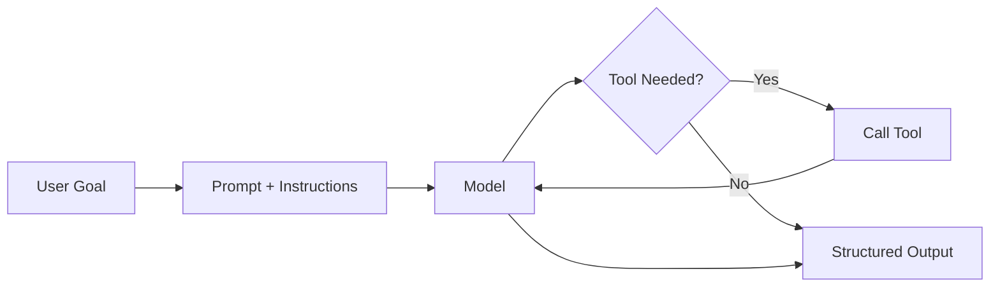
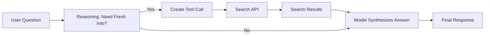

# Chapter 3 (Node.js): Your First Agent (Search & Summarize)

This is the Node.js version of Chapter 3. You will build the same Search & Summarize agent and then apply the same pattern to three additional projects (cafe helper, vacation planner, SQL helper).

If you are a beginner, follow the Search & Summarize project first. The rest reuse the same ideas.

## What You Will Learn

- How to structure a simple agent loop
- How to call a tool safely
- How to return clean, predictable output
- How to test and improve prompts

## Prerequisites

- Node.js 18+ installed
- Basic comfort running a script
- API keys in a `.env` file

## Quick Setup (OpenAI or Ollama)

### Option A: OpenAI

1. Create `.env`:

```
OPENAI_API_KEY=your_key_here
TAVILY_API_KEY=your_key_here
```

2. Install dependencies:

```bash
npm install openai dotenv node-fetch zod
```

### Option B: Ollama (Local)

1. Install Ollama and pull a model:

```bash
ollama pull llama3
```

2. Install dependencies:

```bash
npm install ollama dotenv node-fetch zod
```

## The Core Agent Pattern

1. Receive a goal from the user
2. Decide if a tool is needed
3. Call the tool and collect data
4. Return a structured response

### Core Agent Flow (Visual)



## Main Project: Search & Summarize (ReAct Agent)

### What Is This Agent?

This is a **ReAct Agent** (Reasoning + Acting). It can say: “I don’t know, so I will look it up.”  
Think of it like a research assistant with a smartphone.

### ReAct Loop (Visual)



### Search API (Beginner Default: Tavily)

If you are new to search APIs, use **Tavily**. It is simple and beginner-friendly.

### Create `react_search_openai.js`

```js
import "dotenv/config";
import fetch from "node-fetch";
import OpenAI from "openai";
import { z } from "zod";

const client = new OpenAI({ apiKey: process.env.OPENAI_API_KEY });

const ToolCall = z.object({
  action: z.string(),
  query: z.string(),
});

const FinalAnswer = z.object({
  answer: z.string(),
  sources: z.array(z.string()),
});

async function searchWeb(query) {
  const resp = await fetch("https://api.tavily.com/search", {
    method: "POST",
    headers: { "Content-Type": "application/json" },
    body: JSON.stringify({
      api_key: process.env.TAVILY_API_KEY,
      query,
      max_results: 3,
      include_answer: false,
    }),
  });
  const data = await resp.json();
  return {
    results: (data.results || []).map((r) => ({
      title: r.title || "",
      url: r.url || "",
      snippet: r.content || "",
    })),
  };
}

const systemPrompt =
  "You are a ReAct agent. If you need current information, " +
  "return a JSON tool call with keys: action, query. " +
  "Otherwise return a JSON final answer with keys: answer, sources.";

const userQuestion = "What is the stock price of Tesla right now?";

const resp = await client.responses.create({
  model: "gpt-4.1-mini",
  input: [
    { role: "system", content: systemPrompt },
    { role: "user", content: userQuestion },
  ],
});

const raw = resp.output_text.trim();
let parsed = JSON.parse(raw);

if (parsed.action) {
  const toolCall = ToolCall.parse(parsed);
  const searchData = await searchWeb(toolCall.query);
  const followup =
    `Search results: ${JSON.stringify(searchData)}\n` +
    "Write a final answer as JSON with keys: answer, sources.";

  const resp2 = await client.responses.create({
    model: "gpt-4.1-mini",
    input: [
      { role: "system", content: "You summarize search results." },
      { role: "user", content: followup },
    ],
  });

  const final = FinalAnswer.parse(JSON.parse(resp2.output_text));
  console.log(JSON.stringify(final, null, 2));
} else {
  const final = FinalAnswer.parse(parsed);
  console.log(JSON.stringify(final, null, 2));
}
```

### Create `react_search_ollama.js`

```js
import "dotenv/config";
import fetch from "node-fetch";
import ollama from "ollama";
import { z } from "zod";

const ToolCall = z.object({
  action: z.string(),
  query: z.string(),
});

const FinalAnswer = z.object({
  answer: z.string(),
  sources: z.array(z.string()),
});

async function searchWeb(query) {
  const resp = await fetch("https://api.tavily.com/search", {
    method: "POST",
    headers: { "Content-Type": "application/json" },
    body: JSON.stringify({
      api_key: process.env.TAVILY_API_KEY,
      query,
      max_results: 3,
      include_answer: false,
    }),
  });
  const data = await resp.json();
  return {
    results: (data.results || []).map((r) => ({
      title: r.title || "",
      url: r.url || "",
      snippet: r.content || "",
    })),
  };
}

const systemPrompt =
  "You are a ReAct agent. If you need current information, " +
  "return a JSON tool call with keys: action, query. " +
  "Otherwise return a JSON final answer with keys: answer, sources.";

const userQuestion = "What is the stock price of Tesla right now?";

const resp = await ollama.chat({
  model: "llama3",
  messages: [
    { role: "system", content: systemPrompt },
    { role: "user", content: userQuestion },
  ],
  options: { temperature: 0.2 },
});

const raw = resp.message.content.trim();
let parsed = JSON.parse(raw);

if (parsed.action) {
  const toolCall = ToolCall.parse(parsed);
  const searchData = await searchWeb(toolCall.query);
  const followup =
    `Search results: ${JSON.stringify(searchData)}\n` +
    "Write a final answer as JSON with keys: answer, sources.";

  const resp2 = await ollama.chat({
    model: "llama3",
    messages: [
      { role: "system", content: "You summarize search results." },
      { role: "user", content: followup },
    ],
    options: { temperature: 0.2 },
  });

  const final = FinalAnswer.parse(JSON.parse(resp2.message.content));
  console.log(JSON.stringify(final, null, 2));
} else {
  const final = FinalAnswer.parse(parsed);
  console.log(JSON.stringify(final, null, 2));
}
```

### Terminal Dry Run (Simulated)

```bash
node react_search_openai.js
```

```text
{
  "answer": "Tesla's stock is trading around $215.50 at the moment, up about 2% today.",
  "sources": [
    "https://example.com/market-data",
    "https://example.com/tesla-quote"
  ]
}
```

```bash
node react_search_ollama.js
```

```text
{
  "answer": "Tesla's stock is around $215 today. It is up roughly 2% from the previous close.",
  "sources": [
    "https://example.com/market-data",
    "https://example.com/tesla-quote"
  ]
}
```

## Practice Projects (Same Pattern, Different Context)

Use the same approach from Search & Summarize. Only the input data and output schema change.

### Project A: Cafe Helper Agent

**Goal**: Plan a daily special based on inventory and day of week.

### Project B: Vacation Planner Agent

**Goal**: Suggest a 3‑day trip based on budget and interests.

### Project C: SQL Data Helper Agent

**Goal**: Generate SQL, run it, and summarize results.

## What You Can Build Next (Real-World Use Cases)

- Daily market brief for a business owner
- Competitor tracking for a local cafe or retail shop
- Policy update summaries for HR teams
- Seasonal menu generator with cost estimates
- Weekend trip generator with packing list
- Sales and revenue summaries from a company database
