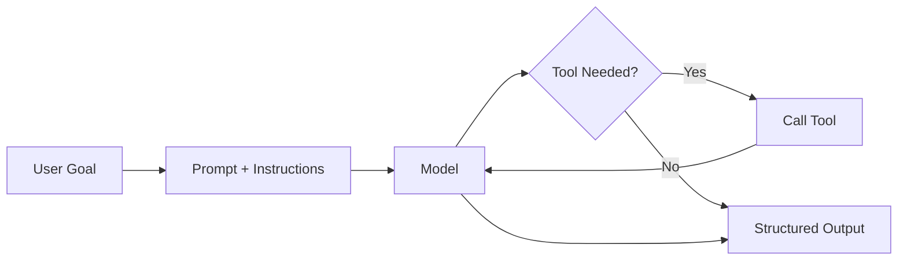
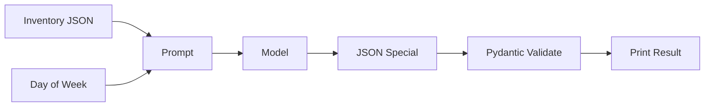
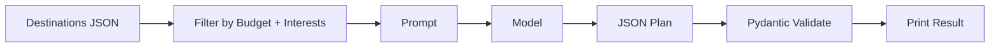
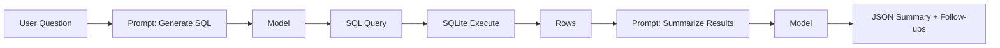

# Chapter 3: Your First Agent

This chapter is your hands-on starting point. You will build a real agent that uses a tool, returns structured output, and follows clear instructions. To make this easier for different backgrounds, you can pick one of three starter agents:

- A cafe helper for a business owner
- A vacation planner for a daily user
- A SQL data helper for a developer

All three projects teach the same core skills. Choose the one that fits your world. If you finish early, try another.

## What You Will Learn

- How to structure a simple agent loop
- How to call a tool safely
- How to return clean, predictable output
- How to test and improve prompts

## Prerequisites

- Python installed
- Basic comfort with running a script
- A model API key set in `.env` (for OpenAI) or Ollama installed locally

If you are new to Python or APIs, skim Chapter 2 before starting.

## Quick Setup (OpenAI or Ollama)

Choose one provider. You can switch later without changing the core logic.

### Option A: OpenAI

1. Create a `.env` file:

```
OPENAI_API_KEY=your_key_here
```

2. Install dependencies:

```bash
pip install openai python-dotenv pydantic
```

### Option B: Ollama (Local)

1. Install Ollama and pull a model:

```bash
ollama pull llama3
```

2. Install dependencies:

```bash
pip install ollama pydantic
```

## The Core Agent Pattern (Used in All Three)

Every starter agent in this chapter follows the same pattern:

1. Receive a goal from the user
2. Decide if a tool is needed
3. Call the tool and collect data
4. Return a structured response

Think of this as a tiny, reliable loop. We are not aiming for magic. We are aiming for a clean, repeatable system.

### Core Agent Flow (Visual)



## Project A: Cafe Helper Agent (Business Owner)

**Goal**: Help a cafe owner plan daily specials based on inventory and the day of week.

**Input example**:

- Inventory: `eggs, spinach, mushrooms, sourdough`
- Day: `Saturday`

**Output (structured)**:

- `special_name`
- `ingredients_used`
- `estimated_prep_time`
- `short_marketing_blurb`

**Tool**:

- A simple inventory lookup (local JSON or a tiny CSV file)

**Why this project works**:

- The problem is small
- The output must be structured
- It feels realistic for business owners

### Cafe Agent Flow (Visual)



### Steps

1. Create a small inventory file
2. Load it in Python
3. Send the inventory + day to the model
4. Validate the model output
5. Print the result in a clean format

### Exact Code (Cafe Helper)

Create a file `inventory.json`:

```json
{
  "eggs": 24,
  "spinach": 12,
  "mushrooms": 10,
  "sourdough": 16,
  "tomatoes": 8
}
```

Create `cafe_agent_openai.py` (OpenAI):

```python
import os
import json
from pydantic import BaseModel
from openai import OpenAI

class CafeSpecial(BaseModel):
    special_name: str
    ingredients_used: list[str]
    estimated_prep_time: str
    short_marketing_blurb: str

client = OpenAI(api_key=os.getenv("OPENAI_API_KEY"))

inventory = json.load(open("inventory.json", "r", encoding="utf-8"))
day = "Saturday"

system_prompt = (
    "You are a helpful cafe assistant. "
    "Return JSON only, matching this schema: "
    "{special_name, ingredients_used, estimated_prep_time, short_marketing_blurb}."
)
user_prompt = (
    f"Inventory: {inventory}\n"
    f"Day: {day}\n"
    "Create a single daily special using available ingredients."
)

resp = client.responses.create(
    model="gpt-4.1-mini",
    input=[
        {"role": "system", "content": system_prompt},
        {"role": "user", "content": user_prompt},
    ],
)
raw = resp.output_text
special = CafeSpecial.model_validate_json(raw)
print(special.model_dump_json(indent=2))
```

Create `cafe_agent_ollama.py` (Ollama):

```python
import json
import ollama
from pydantic import BaseModel

class CafeSpecial(BaseModel):
    special_name: str
    ingredients_used: list[str]
    estimated_prep_time: str
    short_marketing_blurb: str

inventory = json.load(open("inventory.json", "r", encoding="utf-8"))
day = "Saturday"

system_prompt = (
    "You are a helpful cafe assistant. "
    "Return JSON only, matching this schema: "
    "{special_name, ingredients_used, estimated_prep_time, short_marketing_blurb}."
)
user_prompt = (
    f"Inventory: {inventory}\n"
    f"Day: {day}\n"
    "Create a single daily special using available ingredients."
)

resp = ollama.chat(
    model="llama3",
    messages=[
        {"role": "system", "content": system_prompt},
        {"role": "user", "content": user_prompt},
    ],
    options={"temperature": 0.2},
)
raw = resp["message"]["content"]
special = CafeSpecial.model_validate_json(raw)
print(special.model_dump_json(indent=2))
```

### Example Output

```json
{
  "special_name": "Spinach & Mushroom Toast",
  "ingredients_used": ["spinach", "mushrooms", "sourdough", "eggs"],
  "estimated_prep_time": "12 minutes",
  "short_marketing_blurb": "A cozy weekend toast topped with sauteed greens and a soft egg."
}
```

## Project B: Vacation Planner Agent (Daily User)

**Goal**: Help a person plan a short vacation based on budget and preferences.

**Input example**:

- Budget: `$900`
- Duration: `3 days`
- Interests: `food, museums, walkable areas`

**Output (structured)**:

- `destination`
- `day_by_day_plan`
- `estimated_cost`
- `packing_list`

**Tool**:

- A simple dataset of destinations (local JSON)

**Why this project works**:

- Easy for beginners to relate
- Teaches planning and structure
- Demonstrates how tools guide the model

### Vacation Agent Flow (Visual)



### Steps

1. Create a tiny destinations file
2. Filter based on budget and duration
3. Provide the filtered list to the model
4. Ask for a clean JSON plan
5. Validate the response and print it

### Exact Code (Vacation Planner)

Create a file `destinations.json`:

```json
[
  {"city": "Chicago", "avg_3day_cost": 850, "tags": ["food", "museums", "walkable"]},
  {"city": "Austin", "avg_3day_cost": 780, "tags": ["food", "music", "nightlife"]},
  {"city": "Portland", "avg_3day_cost": 700, "tags": ["coffee", "walkable", "parks"]}
]
```

Create `vacation_agent_openai.py` (OpenAI):

```python
import os
import json
from pydantic import BaseModel
from openai import OpenAI

class VacationPlan(BaseModel):
    destination: str
    day_by_day_plan: list[str]
    estimated_cost: str
    packing_list: list[str]

client = OpenAI(api_key=os.getenv("OPENAI_API_KEY"))

budget = 900
duration_days = 3
interests = ["food", "museums", "walkable"]

destinations = json.load(open("destinations.json", "r", encoding="utf-8"))
filtered = [
    d for d in destinations
    if d["avg_3day_cost"] <= budget and all(i in d["tags"] for i in interests)
]

system_prompt = (
    "You are a vacation planner. "
    "Return JSON only, matching this schema: "
    "{destination, day_by_day_plan, estimated_cost, packing_list}."
)
user_prompt = (
    f"Options: {filtered}\n"
    f"Budget: {budget}\n"
    f"Duration: {duration_days} days\n"
    f"Interests: {interests}\n"
    "Pick the best destination and build a simple plan."
)

resp = client.responses.create(
    model="gpt-4.1-mini",
    input=[
        {"role": "system", "content": system_prompt},
        {"role": "user", "content": user_prompt},
    ],
)
raw = resp.output_text
plan = VacationPlan.model_validate_json(raw)
print(plan.model_dump_json(indent=2))
```

Create `vacation_agent_ollama.py` (Ollama):

```python
import json
import ollama
from pydantic import BaseModel

class VacationPlan(BaseModel):
    destination: str
    day_by_day_plan: list[str]
    estimated_cost: str
    packing_list: list[str]

budget = 900
duration_days = 3
interests = ["food", "museums", "walkable"]

destinations = json.load(open("destinations.json", "r", encoding="utf-8"))
filtered = [
    d for d in destinations
    if d["avg_3day_cost"] <= budget and all(i in d["tags"] for i in interests)
]

system_prompt = (
    "You are a vacation planner. "
    "Return JSON only, matching this schema: "
    "{destination, day_by_day_plan, estimated_cost, packing_list}."
)
user_prompt = (
    f"Options: {filtered}\n"
    f"Budget: {budget}\n"
    f"Duration: {duration_days} days\n"
    f"Interests: {interests}\n"
    "Pick the best destination and build a simple plan."
)

resp = ollama.chat(
    model="llama3",
    messages=[
        {"role": "system", "content": system_prompt},
        {"role": "user", "content": user_prompt},
    ],
    options={"temperature": 0.2},
)
raw = resp["message"]["content"]
plan = VacationPlan.model_validate_json(raw)
print(plan.model_dump_json(indent=2))
```

### Example Output

```json
{
  "destination": "Chicago",
  "day_by_day_plan": [
    "Day 1: Riverwalk, deep dish dinner, architecture boat tour",
    "Day 2: Art Institute, Millennium Park, local food market",
    "Day 3: Museum of Science and Industry, coffee crawl"
  ],
  "estimated_cost": "$850",
  "packing_list": ["comfortable shoes", "light jacket", "museum pass"]
}
```

## Project C: SQL Data Helper Agent (Developer)

**Goal**: Help a developer query their own database and explain results.

**Input example**:

- Question: "Which products had the highest revenue last quarter?"

**Output (structured)**:

- `sql_query`
- `result_summary`
- `follow_up_questions`

**Tool**:

- A local SQLite database with sample data

**Why this project works**:

- Very practical for developers
- Shows how agents can work with real data
- Introduces safe SQL practices

### SQL Agent Flow (Visual)



### Steps

1. Create a small SQLite database
2. Ask the model to generate a SQL query
3. Run the query
4. Feed results back to the model
5. Return a summary and follow-ups

### Exact Code (SQL Data Helper)

Create `init_db.py`:

```python
import sqlite3

conn = sqlite3.connect("sales.db")
cur = conn.cursor()
cur.execute("DROP TABLE IF EXISTS sales")
cur.execute("""
CREATE TABLE sales (
  product_name TEXT,
  quarter TEXT,
  revenue INTEGER
)
""")
cur.executemany(
    "INSERT INTO sales VALUES (?, ?, ?)",
    [
        ("Product A", "Q4", 120000),
        ("Product B", "Q4", 108000),
        ("Product C", "Q4", 65000),
        ("Product A", "Q3", 98000),
        ("Product B", "Q3", 91000),
    ],
)
conn.commit()
conn.close()
```

Create `sql_agent_openai.py` (OpenAI):

```python
import os
import sqlite3
from pydantic import BaseModel
from openai import OpenAI

class SQLAnswer(BaseModel):
    sql_query: str
    result_summary: str
    follow_up_questions: list[str]

client = OpenAI(api_key=os.getenv("OPENAI_API_KEY"))

question = "Which products had the highest revenue last quarter?"

system_prompt = (
    "You are a data assistant. "
    "Return JSON only, matching this schema: "
    "{sql_query, result_summary, follow_up_questions}. "
    "Use SQLite syntax."
)
user_prompt = f"Question: {question}"

resp = client.responses.create(
    model="gpt-4.1-mini",
    input=[
        {"role": "system", "content": system_prompt},
        {"role": "user", "content": user_prompt},
    ],
)
raw = resp.output_text
answer = SQLAnswer.model_validate_json(raw)

conn = sqlite3.connect("sales.db")
cur = conn.cursor()
cur.execute(answer.sql_query)
rows = cur.fetchall()
conn.close()

result_prompt = (
    f"SQL: {answer.sql_query}\n"
    f"Rows: {rows}\n"
    "Summarize in one short paragraph and suggest 2 follow-up questions. "
    "Return JSON with keys: result_summary, follow_up_questions."
)

resp2 = client.responses.create(
    model="gpt-4.1-mini",
    input=[
        {"role": "system", "content": "You summarize SQL results."},
        {"role": "user", "content": result_prompt},
    ],
)
raw2 = resp2.output_text
summary = SQLAnswer.model_validate_json(
    f'{{"sql_query": "{answer.sql_query}", {raw2.strip().lstrip("{")}'
)

print(summary.model_dump_json(indent=2))
```

Create `sql_agent_ollama.py` (Ollama):

```python
import sqlite3
import ollama
from pydantic import BaseModel

class SQLAnswer(BaseModel):
    sql_query: str
    result_summary: str
    follow_up_questions: list[str]

question = "Which products had the highest revenue last quarter?"

system_prompt = (
    "You are a data assistant. "
    "Return JSON only, matching this schema: "
    "{sql_query, result_summary, follow_up_questions}. "
    "Use SQLite syntax."
)
user_prompt = f"Question: {question}"

resp = ollama.chat(
    model="llama3",
    messages=[
        {"role": "system", "content": system_prompt},
        {"role": "user", "content": user_prompt},
    ],
    options={"temperature": 0.2},
)
raw = resp["message"]["content"]
answer = SQLAnswer.model_validate_json(raw)

conn = sqlite3.connect("sales.db")
cur = conn.cursor()
cur.execute(answer.sql_query)
rows = cur.fetchall()
conn.close()

result_prompt = (
    f"SQL: {answer.sql_query}\n"
    f"Rows: {rows}\n"
    "Summarize in one short paragraph and suggest 2 follow-up questions. "
    "Return JSON with keys: result_summary, follow_up_questions."
)

resp2 = ollama.chat(
    model="llama3",
    messages=[
        {"role": "system", "content": "You summarize SQL results."},
        {"role": "user", "content": result_prompt},
    ],
    options={"temperature": 0.2},
)
raw2 = resp2["message"]["content"]
summary = SQLAnswer.model_validate_json(
    f'{{"sql_query": "{answer.sql_query}", {raw2.strip().lstrip("{")}'
)

print(summary.model_dump_json(indent=2))
```

### Example Output

```json
{
  "sql_query": "SELECT product_name, SUM(revenue) AS total_revenue FROM sales WHERE quarter = 'Q4' GROUP BY product_name ORDER BY total_revenue DESC LIMIT 5;",
  "result_summary": "Product A and Product B led revenue in Q4, with Product A ahead by roughly 12 percent.",
  "follow_up_questions": [
    "Do you want this broken down by region?",
    "Should we compare against Q3?"
  ]
}
```

## Choose Your Path

Pick one project and build it end-to-end. If you finish early, try another project to strengthen the pattern.

## Common Pitfalls

- Vague prompts produce messy output
- Missing validation causes fragile systems
- Tool results should be passed back to the model, not ignored

## Running Each Project

```bash
python cafe_agent_openai.py
python cafe_agent_ollama.py
python vacation_agent_openai.py
python vacation_agent_ollama.py
python init_db.py
python sql_agent_openai.py
python sql_agent_ollama.py
```

## Terminal Dry Run (Simulated)

These are example terminal runs so you know what “good” looks like. Your output will vary slightly.

### Cafe Agent (OpenAI)

```bash
python cafe_agent_openai.py
```

```text
{
  "special_name": "Spinach & Mushroom Toast",
  "ingredients_used": ["spinach", "mushrooms", "sourdough", "eggs"],
  "estimated_prep_time": "12 minutes",
  "short_marketing_blurb": "A cozy weekend toast topped with sauteed greens and a soft egg."
}
```

### Cafe Agent (Ollama)

```bash
python cafe_agent_ollama.py
```

```text
{
  "special_name": "Saturday Sunrise Toast",
  "ingredients_used": ["sourdough", "eggs", "spinach", "tomatoes"],
  "estimated_prep_time": "10 minutes",
  "short_marketing_blurb": "Weekend toast with soft eggs, greens, and fresh tomatoes."
}
```

### Vacation Agent (OpenAI)

```bash
python vacation_agent_openai.py
```

```text
{
  "destination": "Chicago",
  "day_by_day_plan": [
    "Day 1: Riverwalk, deep dish dinner, architecture boat tour",
    "Day 2: Art Institute, Millennium Park, local food market",
    "Day 3: Museum of Science and Industry, coffee crawl"
  ],
  "estimated_cost": "$850",
  "packing_list": ["comfortable shoes", "light jacket", "museum pass"]
}
```

### Vacation Agent (Ollama)

```bash
python vacation_agent_ollama.py
```

```text
{
  "destination": "Portland",
  "day_by_day_plan": [
    "Day 1: Coffee tour, Washington Park, local food carts",
    "Day 2: Art museum, river walk, dinner in Pearl District",
    "Day 3: Forest Park hike, Powell's Books, tea stop"
  ],
  "estimated_cost": "$720",
  "packing_list": ["comfortable shoes", "light jacket", "reusable water bottle"]
}
```

### SQL Agent (OpenAI)

```bash
python init_db.py
python sql_agent_openai.py
```

```text
{
  "sql_query": "SELECT product_name, SUM(revenue) AS total_revenue FROM sales WHERE quarter = 'Q4' GROUP BY product_name ORDER BY total_revenue DESC LIMIT 5;",
  "result_summary": "Product A and Product B led revenue in Q4, with Product A ahead by roughly 12 percent.",
  "follow_up_questions": [
    "Do you want this broken down by region?",
    "Should we compare against Q3?"
  ]
}
```

### SQL Agent (Ollama)

```bash
python init_db.py
python sql_agent_ollama.py
```

```text
{
  "sql_query": "SELECT product_name, SUM(revenue) AS total_revenue FROM sales WHERE quarter = 'Q4' GROUP BY product_name ORDER BY total_revenue DESC LIMIT 5;",
  "result_summary": "Product A has the highest Q4 revenue, followed by Product B and Product C.",
  "follow_up_questions": [
    "Do you want to compare Q4 to Q3?",
    "Should we group results by product category?"
  ]
}
```

## Checklist

- My agent accepts a clear user goal
- My agent uses at least one tool
- My output is structured (JSON or a defined schema)
- I can explain what happens at each step

## What Comes Next

In Chapter 4, you will add memory and context so your agent can handle larger tasks without losing the thread.
